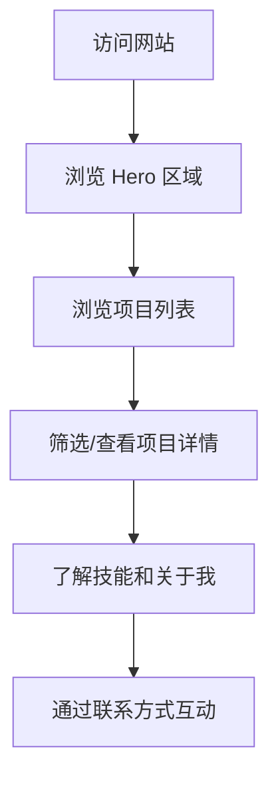

# 个人作品集网站 - 产品需求文档

## 1. 产品概述

一个极简现代风格的作品展示网站，用于展示开发项目和个人品牌。该网站面向个人品牌建设和粉丝群体，通过精心设计的界面展现开发者的技术实力和创意能力。

- 通过清晰、专业的视觉呈现，提升个人品牌形象
- 突出展示开发项目的技术亮点和创新之处
- 提供流畅的浏览体验，让访客轻松了解开发者的工作成果

## 2. 核心功能

### 2.1 页面结构

单页应用，包含以下核心模块：

1. **首页/作品展示页**
   - Hero 区域：个人品牌介绍和视觉焦点
   - 项目展示区：展示精选开发项目
   - 关于我区域：个人简介和技能展示
   - 联系方式区域

### 2.2 页面详细设计

| 页面/区域 | 模块名称 | 功能描述 |
|-----------|----------|----------|
| 首页 | Hero 区域 | 全屏视觉区域，展示个人品牌标语和主视觉，底部渐变指示器 |
| 首页 | 导航栏 | 固定顶部导航，包含 Logo、导航链接、主题切换 |
| 首页 | 项目展示区 | 卡片式布局展示项目，支持分类筛选，悬停显示项目详情 |
| 首页 | 技能展示区 | 可视化技能展示，使用进度条或图标形式 |
| 首页 | 关于我区域 | 个人照片、简介文字、社交媒体链接 |
| 首页 | 页脚 | 版权信息、联系方式、备案号 |

## 3. 用户交互流程

用户访问网站的主要流程：

### 3.1 主要交互

- **导航交互**：点击导航链接平滑滚动到对应区域
- **项目交互**：悬停卡片显示详细信息，点击可查看项目详情弹窗
- **筛选交互**：点击分类标签筛选不同类型的项目
- **主题切换**：支持亮色/暗色主题切换

## 4. 用户界面设计

### 4.1 设计风格

**极简现代风格**

- **色彩方案**：
  - 主色调：深灰/纯白 (#0a0a0a / #ffffff)
  - 强调色：科技蓝 (#3b82f6)
  - 次要色：灰色渐变 (#6b7280 / #374151)
  - 背景：纯白/深黑，支持平滑过渡

- **字体选择**：
  - 标题：Plus Jakarta Sans (粗体、现代感强)
  - 正文：Inter (清晰易读、专业)
  - 代码展示：JetBrains Mono (等宽字体)

- **布局风格**：
  - 基于网格的响应式布局
  - 大量留白，突出内容
  - 卡片式组件设计
  - 微妙的阴影和边框

- **动效设计**：
  - 页面加载时的渐入动画
  - 悬停状态下的微妙缩放和阴影变化
  - 平滑的滚动行为
  - 主题切换时的颜色过渡

### 4.2 页面设计细节

**Hero 区域**
- 全屏设计，垂直居中内容
- 大号标题 + 副标题
- CTA 按钮指向项目区域
- 背景使用微妙的渐变或几何图形

**项目展示区**
- 网格布局 (桌面端 3 列，平板 2 列，移动端 1 列)
- 项目卡片包含：封面图、标题、技术栈标签、简短描述
- 悬停效果：卡片上浮、显示"查看详情"按钮
- 分类标签栏支持技术类型筛选

**技能展示区**
- 分类展示：前端、后端、工具链等
- 使用圆角进度条可视化技能熟练度
- 悬停显示详细描述

**关于我区域**
- 左侧：个人照片或头像
- 右侧：个人简介段落
- 底部：社交媒体图标链接

### 4.3 响应式设计

- **桌面端 (≥1024px)**：完整三列布局，大尺寸视觉
- **平板端 (768px-1023px)**：两列布局，适度间距
- **移动端 (<768px)**：单列布局，汉堡菜单，触摸优化

## 5. 技术实现要求

### 5.1 性能要求

- 首屏加载时间 < 2 秒
- 图片使用懒加载
- CSS 动画优先于 JavaScript 动画
- 响应式图片支持

### 5.2 无障碍要求

- 语义化 HTML 标签
- 适当的 ARIA 标签
- 键盘导航支持
- 足够的颜色对比度

### 5.3 SEO 优化

- 语义化的标题层级
- Meta 标签优化
- Open Graph 标签
- 结构化数据支持
