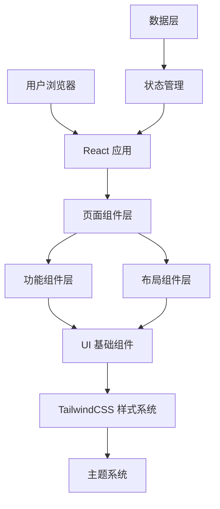

# 个人作品集网站 - 技术架构文档

## 1. 架构设计

前端单页应用架构，采用现代化的组件化开发模式。



**架构层次说明：**

- **页面组件层**：Hero、项目展示、技能、关于我等页面级组件
- **功能组件层**：可复用的业务逻辑组件（项目卡片、导航栏等）
- **布局组件层**：Header、Footer、Container 等布局组件
- **UI 基础组件**：Button、Card、Modal 等基础 UI 组件
- **样式系统**：基于 TailwindCSS 的样式解决方案和主题系统

## 2. 技术栈

### 2.1 核心技术

- **框架**：React 18
- **构建工具**：Vite
- **样式方案**：Tailwind CSS 3
- **动画库**：Framer Motion
- **路由管理**：React Router DOM (Hash Router for SPA)
- **状态管理**：React Context API (主题切换)
- **图标库**：Lucide React

### 2.2 项目初始化

使用 Vite 快速初始化 React + TypeScript 项目：

```bash
npm create vite@latest portfolio -- --template react-ts
cd portfolio
npm install
npm install -D tailwindcss postcss autoprefixer
npx tailwindcss init -p
npm install framer-motion lucide-react react-router-dom
```

## 3. 路由定义

单页应用，所有内容在首页通过滚动或锚点访问。

| 路由 | 路径 | 功能描述 |
|------|------|----------|
| 首页 | `/` | 包含所有内容区域的单页 |

### 3.1 导航锚点

| 锚点 ID | 区域 | 描述 |
|---------|------|------|
| `#home` | Hero 区域 | 首页顶部 |
| `#projects` | 项目展示 | 项目作品列表 |
| `#skills` | 技能展示 | 技术栈和熟练度 |
| `#about` | 关于我 | 个人介绍和联系方式 |

## 4. 组件结构

```
src/
├── components/
│   ├── layout/
│   │   ├── Header.tsx          # 固定顶部导航栏
│   │   ├── Footer.tsx          # 页脚组件
│   │   └── Container.tsx       # 内容容器
│   ├── sections/
│   │   ├── Hero.tsx            # Hero 区域
│   │   ├── Projects.tsx        # 项目展示区
│   │   ├── Skills.tsx          # 技能展示区
│   │   └── About.tsx           # 关于我区域
│   └── ui/
│       ├── Button.tsx          # 按钮组件
│       ├── Card.tsx            # 卡片组件
│       ├── Badge.tsx           # 标签组件
│       ├── ProjectCard.tsx     # 项目卡片
│       ├── SkillBar.tsx        # 技能进度条
│       └── SocialLinks.tsx     # 社交链接
├── context/
│   └── ThemeContext.tsx        # 主题状态管理
├── data/
│   └── portfolio.ts            # 项目数据和配置
├── App.tsx                     # 根组件
├── main.tsx                    # 应用入口
└── index.css                  # 全局样式和 Tailwind 入口
```

## 5. 数据模型

### 5.1 项目数据结构

```typescript
interface Project {
  id: string;
  title: string;
  description: string;
  category: 'frontend' | 'backend' | 'fullstack' | 'mobile';
  tags: string[];
  image: string;
  demo?: string;
  github?: string;
  featured: boolean;
}
```

### 5.2 技能数据结构

```typescript
interface Skill {
  name: string;
  level: number; // 1-100
  category: 'frontend' | 'backend' | 'tools';
}
```

### 5.3 个人资料数据结构

```typescript
interface Profile {
  name: string;
  title: string;
  bio: string;
  avatar: string;
  social: {
    github?: string;
    twitter?: string;
    linkedin?: string;
    email?: string;
  };
}
```

## 6. 主题系统

### 6.1 主题配置

```typescript
type Theme = 'light' | 'dark';

interface ThemeContextType {
  theme: Theme;
  toggleTheme: () => void;
}
```

### 6.2 CSS 变量

```css
:root {
  --color-primary: #3b82f6;
  --color-bg: #ffffff;
  --color-text: #0a0a0a;
  --color-text-secondary: #6b7280;
  --color-border: #e5e7eb;
}

.dark {
  --color-bg: #0a0a0a;
  --color-text: #ffffff;
  --color-text-secondary: #9ca3af;
  --color-border: #374151;
}
```

## 7. 核心功能实现

### 7.1 平滑滚动导航

使用 CSS `scroll-behavior: smooth` 和锚点跳转实现页面内导航。

### 7.2 项目筛选

通过 `useState` 管理当前筛选类别，动态过滤项目列表。

### 7.3 主题切换

使用 React Context 管理和持久化主题状态，存储在 localStorage。

### 7.4 动画效果

使用 Framer Motion 实现：

- 页面加载渐入动画
- 悬停微交互
- 滚动触发动画
- 主题切换过渡

## 8. 响应式断点

```typescript
const breakpoints = {
  mobile: '640px',   // < 640px
  tablet: '768px',   // 768px - 1023px
  desktop: '1024px', // >= 1024px
  large: '1280px',   // >= 1280px
};
```

使用 Tailwind CSS 响应式前缀：`sm:`、`md:`、`lg:`、`xl:`。

## 9. 性能优化

- 图片使用 WebP 格式和懒加载
- 组件使用 `React.memo` 优化重渲染
- 使用 CSS 动画替代 JavaScript 动画
- Tree-shaking 移除未使用的代码
- 代码分割（按需加载）
